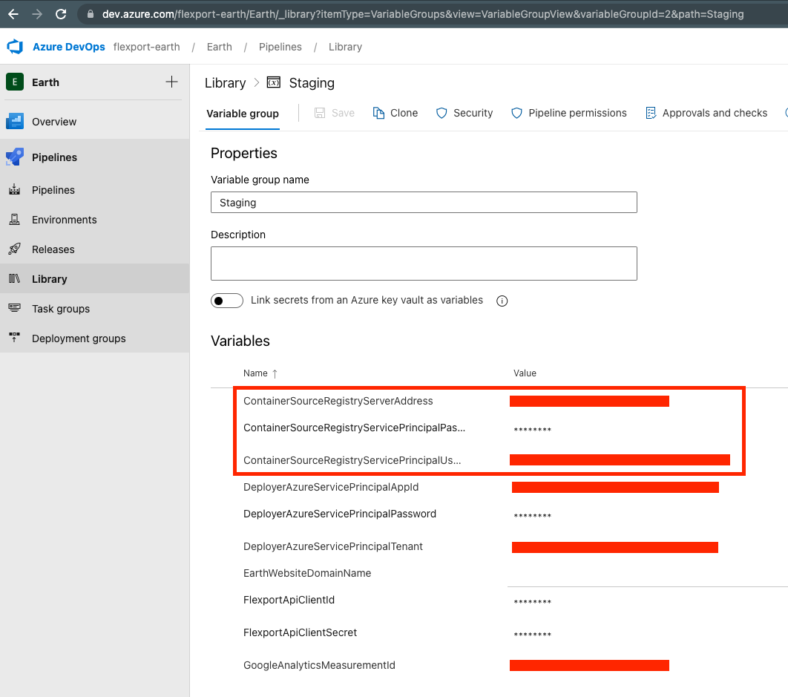
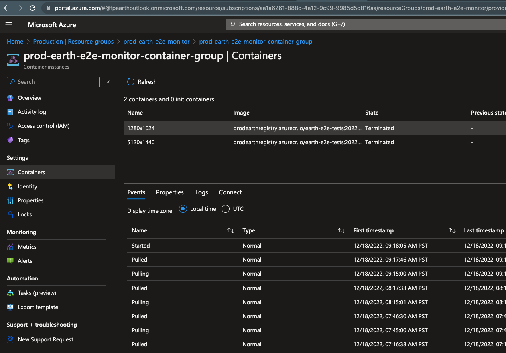

# Earth Container Infrastructure

Earth uses the [Azure Container Registry](https://azure.microsoft.com/en-us/products/container-registry) to host private Docker container images.

Each Earth environment has its own registry for hosting images that it uses.

The CI/CD pipeline diagram shows this and roughly how container images move through the environments.

# Managing Container Registry Infrastructure

You can find the Azure Container Registries via the Azure Portal within any of the Earth environments.

The registries are hosted in their own Resource Group named `<environment-name>-earth-container-infra`.

For example, here's the registry for Staging:

## Configuration in the CI/CD Pipelines

If you need to add or change the Service Principal credentials that the CI/CD pipelines use when importing container images from lower environment registries, you can do so via the variables for a given environment in [Azure DevOps](https://dev.azure.com/flexport-earth/Earth/_library?itemType=VariableGroups):

# Managing Containers

You can find the Azure Container instances via the Azure Portal. The container instances will reside in various Resource Groups belonging to the various components that they serve. For example, the E2E Test Monitor users Container Instances to run the E2E tests, so you'll find the container instances for that under the E2E Monitor Resource Group:

For details on how to access the containers, logs, metrics, etc. please see the Azure documentation here:

https://learn.microsoft.com/en-us/azure/container-instances
