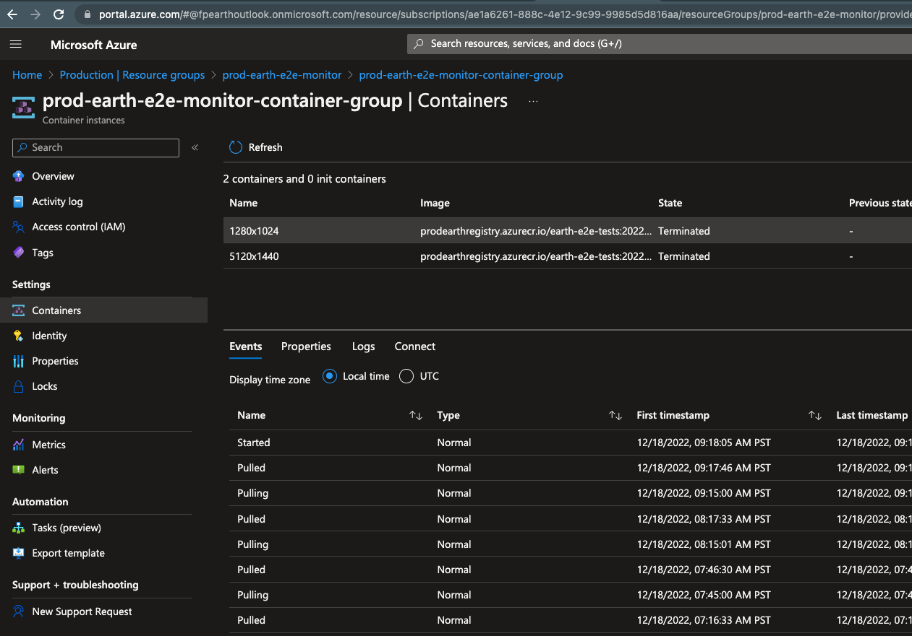

# E2E Test Monitor

The End to End Test Monitor is a component that periodically executes the Earth End to End Functional Tests.

This serves two purposes:

1. Periodic verification that the Earth user functionality is actually working.
2. Generating synthetic traffic often enough to keep the Earth content "warm" in the CDN cache.

The E2E Test Monitor runs on Azure Container Instances and can be found in the `<environment-name>-earth-e2e-monitor` resource group.

For example, here's Production:

From there, you can click on the `Containers` menu item to see the individual containers that exist in the Container Group:

You'll notice that there's different containers for different screen resolutions.

The reason for this is that the Earth website generates different content for different screen sizes.

So in order to test for, and cache content for various screen sizes, that content must be requested. So for each screen size we want to support, we should have a separate Container Instance that is using it.

It's a good idea to periodically check the [Production Google Analytics account](https://analytics.google.com/analytics/web/#/p338490015/reports/explorer?params=_u..nav%3Dmaui%26_u.comparisonOption%3Ddisabled%26_u.date00%3D20221201%26_u.date01%3D20221216%26_r.explorerCard..selmet%3D%5B%22activeUsers%22%5D%26_r.explorerCard..seldim%3D%5B%22screenResolution%22%5D&r=user-technology-detail&collectionId=user) to see what resolutions are being used by actual users and tweak the E2E Test Monitor containers accordingly:

You can adjust the E2E Test Monitor Containers [here](https://github.com/flexport/flexport-earth/blob/main/src/releasables/testing/e2e/monitor/infrastructure/container-group.bicep#L34).
