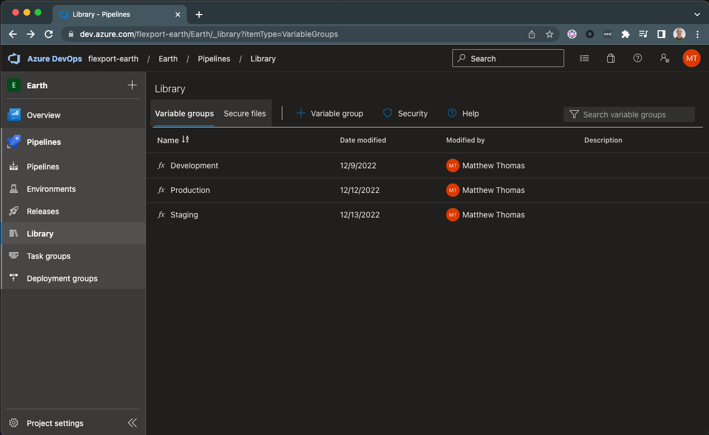
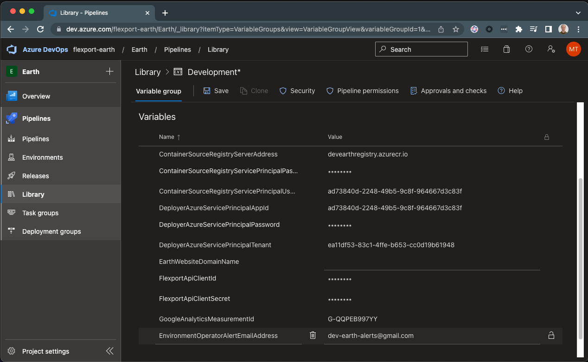

## Provisioning Azure for Earth

### Login

Login as the Azure Subscription Owner:

    az login

If you work with multiple subscriptions, be sure to set the correct default subscription that the Earth scripts should use:

    az account set --subscription "<subscription name here>"

### Provision a new Azure Tenant

    ./src/azure/provisioning/tenant-provision.ps1

### Provision a new Azure Subscription

1. Run the Azure Subscription provisioning automation script:

    ./src/azure/provisioning/subscription-provision.ps1 -AzureSubscriptionName "<subscription name here>"

2. Alert Email

    If the new Azure Subscription / Environment is a shared environment, then you'll want to create a Google Group to receive the alerts so that multiple people can receive the alerts.

    If the new Azure Subscription / Environment belongs just to you or some other individual, then that individuals preferred email address can be used without needing a Google Group.

    Once you've got a Google Group or individual email address to use for sending alerts, you need to configure it to be used.

    **Shared Environments**

    Add the `EnvironmentOperatorAlertEmailAddress` setting to the relevant Azure DevOps Variable Library group:

    

    

**Personal Environments**

- Add `EnvironmentOperatorAlertEmailAddress` to your local configuration. The developer automation scripts will prompt you for this value.

## Deprovisioning

You can also remove the Earth setup from Azure.

## Deprovision an Azure Subscription

    ./src/azure/provisioning/subscription-deprovision.ps1 -AzureSubscriptionName "<subscription name here>"

## Deprovision an Azure Tenant

    ./src/azure/provisioning/tenant-deprovision.ps1
