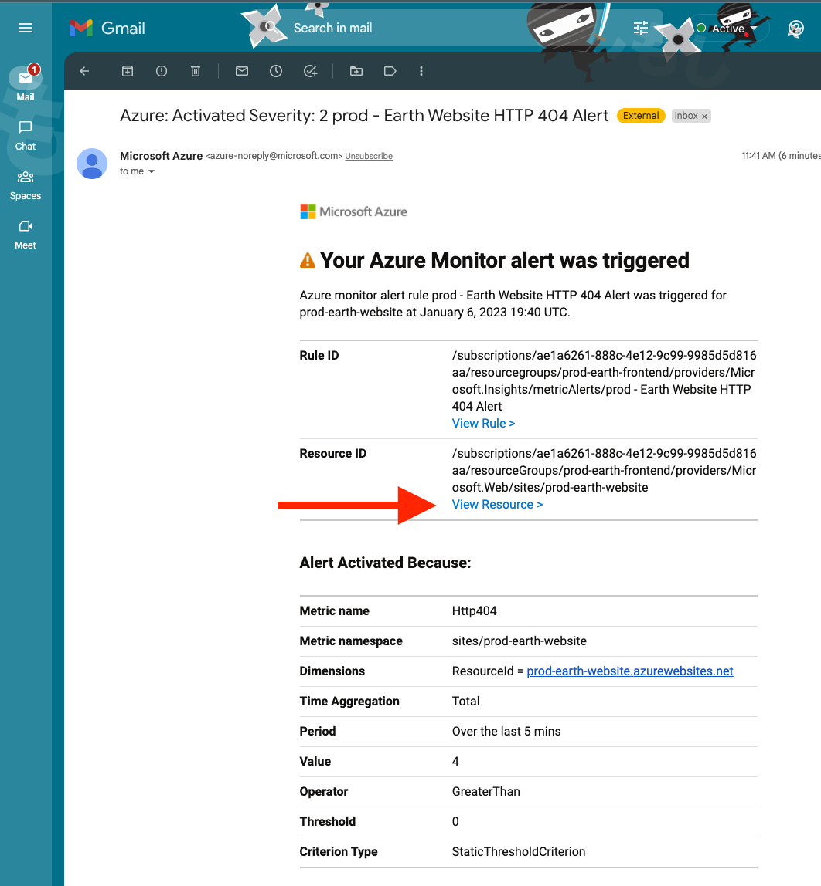
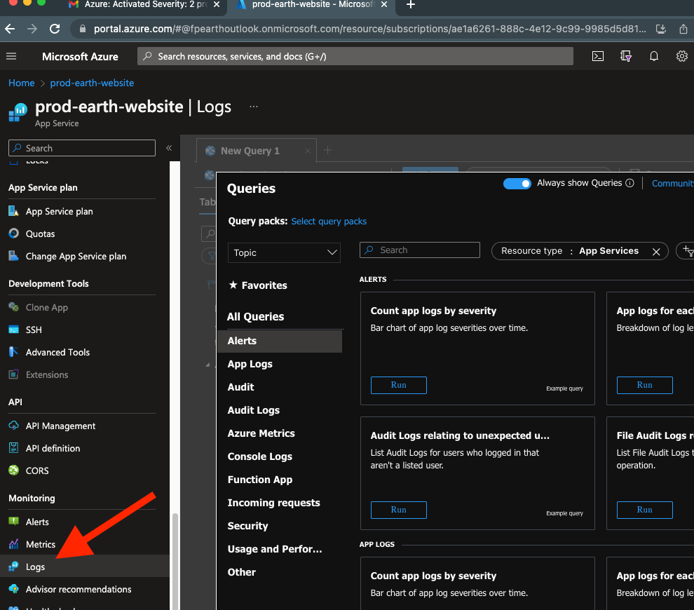
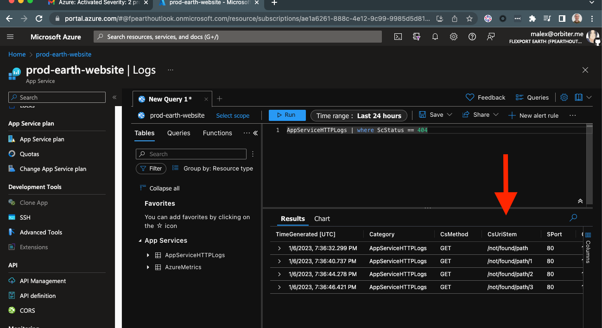

# Action Groups Overview

[Azure Action Groups](https://learn.microsoft.com/en-us/shows/azure-friday/azure-monitor-action-groups) define a group of people to repond to various Earth infrastructure and application events, and how to notify them.

This group of people is also know as Earth Environment Operators, people who are responsible for operating and administering Flexport Earth.

Each Earth environment has its own Action Groups and Email Accounts to send alerts to.

# HTTP 404 Alerts

When a HTTP 404 error is detected in the Earth Website, an alert will be sent to the Earth Environment Operator(s) configured in the aforementioned Action Group.

**How can I see details about the HTTP request that failed, such as the URL?**

1. Open the Azure portal to the affected website by clicking the `View Resource` link:

2. Click the `Logs` menu item:

3. Run a query against the logs to get the HTTP 404 requests:

